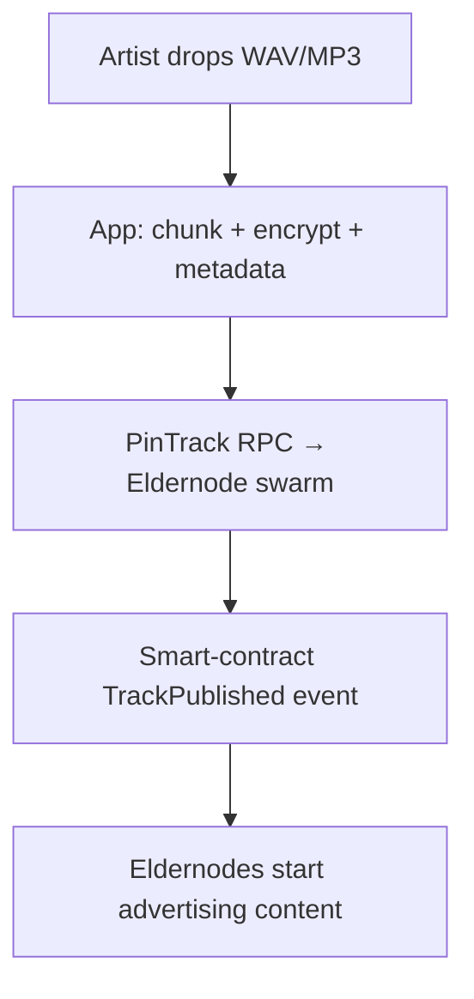

# DIGM P2P Audio Storage & Streaming Architecture

> A reference blueprint for fault-tolerant, low-latency, **artist-owned** audio delivery on the Fuego Elder-Node network.

---

## 1  Transport Layer – how the bytes move

### 1.1  libp2p / GossipSub backbone
* Every Elder-Node runs a `libp2p` daemon.
* Nodes auto-discover via Kademlia DHT and broadcast track-hash ↔ location announcements on the `digm.audio.v1` GossipSub topic.
* Browsers speak WebRTC; desktop nodes use TCP/QUIC for higher throughput.

### 1.2  WebRTC Data-Channels (browser ↔ node, browser ↔ browser)
* Listeners receive the hash list from GossipSub, then open direct Data-Channels to peers that advertise the required chunks.
* NAT traversal is handled by public STUN/TURN servers; Elder-Nodes can act as TURN relays when needed.

### 1.3  HTTP/2 / QUIC fallback (range requests)
* Each Elder-Node also exposes `https://<node-id>.digm.audio/{chunkHash}` so mobile clients with restricted networking can still stream.

---

## 2  Storage Layer – where the bytes live

### 2.1  Chunked, encrypted objects
1. Artist’s client splits the master FLAC/MP3 into fixed-size chunks (e.g. 512 KiB).
2. Each chunk is encrypted with **AES-GCM**. The track-key is wrapped in the buyer’s public key at purchase time, so Elder-Nodes never see plaintext.
3. A SHA-256 digest over every chunk becomes `chunkHash`.
4. A Merkle tree over all `chunkHash` values produces the **track root** – the canonical ID stored on-chain in the Fuego contract.

### 2.2  Redundant pinning on Elder-Nodes
* The uploading wallet places a **pin order** on the network:
  ```json
  {
    "trackRoot": "<merkleRoot>",
    "desiredReplicas": 7,
    "duration": "18 months"
  }
  ```
* Eldernodes (or COLD L3 nodes) stake collateral (DI₲M or XFG/HEAT) to receive PARA rewards for keeping the chunk online and passing audit-proofs.

### 2.3  Audit-proofs (“Fresh Index”)
* Once per epoch a random subset of nodes must return the SHA-256 of a random byte-range inside a chunk they claim to hold.
* The smart contract **slashes** a node’s stake after three consecutive failures.
* A JSON feed (similar to `fuego_fresh_index.json`) records which nodes are currently healthy so clients can prefer them.

---

## 3  Streaming Layer – how the player sees it

### 3.1  HLS/DASH manifest generated on the fly
* Manifests (`.m3u8` / `.mpd`) contain **chunk hashes** instead of HTTP URLs.
* The custom player asks the libp2p DHT for peers advertising each hash; if none answer quickly it falls back to HTTPS on an Elder-Node.

### 3.2  Progressive unlock
* Only the first *N* seconds are decrypted with a temporary preview key so non-premium users can sample.
* After purchase or premium validation the full track key is delivered via the wallet and the rest of the chunks are decrypted in-place – no double download.

---

## 4  Upload / Ingress Workflow

1. **Artist** drops a file into the DIGM desktop app.
2. App extracts metadata, performs chunking & encryption.
3. App sends `PinTrack` to swarm; Elder-Nodes store the chunks.
4. Contract emits `TrackPublished`, making the track discoverable.

---

## 5  Why this works well for DIGM
* **True P2P** – no central servers, every node is equal & rewarded.
* **Censorship-resistant** – sharded, encrypted content means no single takedown point.
* **Smooth playback** – QUIC + multi-peer fetching gives fast start-up and gapless audio.
* **On-chain integrity** – Merkle root ties exact audio bits to the sale transaction.
* **Fair rewards** – audit-proofs & stake slashing keep storage honest; PARA payments flow to nodes proportional to uptime/bandwidth.

---

## 6  Next Steps to Implement
1. Add `@chainsafe/libp2p` (JS) or `rust-libp2p` daemon to the repo.
2. Create a `storage-service` module with the chunker, AES-GCM encryptor, and Merkle tree builder (~300 LOC).
3. Build a minimal Rust/Tauri background process so heavy crypto does not block the React UI.
4. Write a React `P2PPlayerProvider` that supplies a `ReadableStream` backed by libp2p pulls.
5. Draft the **PinTrack** and **AuditProof** message formats; integrate them into the existing Fuego smart contract.
6. Spin up 3–5 test Elder-Nodes on inexpensive VPS instances, publish public-domain tracks, and measure startup time & re-buffering.

---

*Prepared by DIGM core contributors – let’s build the future of music, one block, one note, one stream at a time.* 
